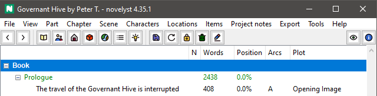

# nv_toolbar

The [noveltree](https://peter88213.github.io/noveltree/) Python program helps authors organize novels.  

*nv_toolbar* is a plugin providing buttons for frequently used commands. 

## Requirements

- [noveltree](https://peter88213.github.io/noveltree/) version 1.0+

### Note for Linux users

To see the tooltips, please make sure that your Python3 installation has the *idlelib* module. On Ubuntu, for example, it is not available out of the box and must be installed via a separate package named *idle3*. 

## Download and install

[Download the latest release (version 2.3.0)](https://github.com/peter88213/noveltree_toolbar/raw/main/dist/nv_toolbar_v2.3.0.zip)

- Extract the "nv_toolbar_v2.3.0" folder from the downloaded zipfile "nv_toolbar_v2.3.0.zip".
- Move into this new folder and launch **setup.pyw**. This installs the plugin for the local user.

---

[Changelog](changelog)

## Usage

See the [instructions for use](usage)

---

## Credits

The Icons are based on the [Eva Icons](https://akveo.github.io/eva-icons/#/), published under the [MIT License](http://www.opensource.org/licenses/mit-license.php). The original black and white icons were colored for this plugin by the maintainer. 

---

## License

This is Open Source software, and the *nv_toolbar* plugin is licensed under GPLv3. See the
[GNU General Public License website](https://www.gnu.org/licenses/gpl-3.0.en.html) for more
details, or consult the [LICENSE](https://github.com/peter88213/noveltree_toolbar/blob/main/LICENSE) file.
