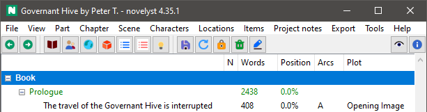

# novelyst_buttons

The [novelyst](https://peter88213.github.io/novelyst/) Python program helps authors organize novels.  

*novelyst_buttons* is a plugin providing buttons for frequently used actions. 

## Requirements

- [novelyst](https://peter88213.github.io/novelyst/) version 4.35+

### Note for Linux users

To see the tooltips, please make sure that your Python3 installation has the *idlelib* module. On Ubuntu, for example, it is not available out of the box and must be installed via a separate package named *idle3*. 

## Download and install

[Download the latest release (version 1.3.1)](https://github.com/peter88213/novelyst_buttons/raw/main/dist/novelyst_buttons_v1.3.1.zip)

- Extract the "novelyst_buttons_v1.3.1" folder from the downloaded zipfile "novelyst_buttons_v1.3.1.zip".
- Move into this new folder and launch **setup.pyw**. This installs the plugin for the local user.

---

[Changelog](changelog)

## Usage

See the [instructions for use](usage)

---

# Credits

[Back icons created by Freepik - Flaticon](https://www.flaticon.com/free-icons/back)

[Next icons created by Freepik - Flaticon](https://www.flaticon.com/free-icons/next)

[Book icons created by Freepik - Flaticon](https://www.flaticon.com/free-icons/book)

[People icons created by Freepik - Flaticon](https://www.flaticon.com/free-icons/people)

[Location icons created by Freepik - Flaticon](https://www.flaticon.com/free-icons/location)

[Smart key icons created by Freepik - Flaticon](https://www.flaticon.com/free-icons/smart-key)

[Globe icons created by Freepik - Flaticon](https://www.flaticon.com/free-icons/globe)

[Process icons created by Freepik - Flaticon](https://www.flaticon.com/free-icons/process)

[App icons created by Freepik - Flaticon](https://www.flaticon.com/free-icons/app)

[Save icons created by Freepik - Flaticon](https://www.flaticon.com/free-icons/save)

[Refresh icons created by Freepik - Flaticon](https://www.flaticon.com/free-icons/refresh)

[Lock icons created by Freepik - Flaticon](https://www.flaticon.com/free-icons/lock)

[Cancel icons created by Freepik - Flaticon](https://www.flaticon.com/free-icons/cancel)

[Feather icons created by Freepik - Flaticon](https://www.flaticon.com/free-icons/feather)

[Paper icons created by Freepik - Flaticon](https://www.flaticon.com/free-icons/paper)

[Info icons created by Freepik - Flaticon](https://www.flaticon.com/free-icons/info)

---

## License

This is Open Source software, and the *novelyst_buttons* plugin is licensed under GPLv3. See the
[GNU General Public License website](https://www.gnu.org/licenses/gpl-3.0.en.html) for more
details, or consult the [LICENSE](https://github.com/peter88213/novelyst_buttons/blob/main/LICENSE) file.
